# CS124: Interaction Design Lab 1

(Saatvik Sejpal, Anirudh Satish
)

## Design Decisions

### Early Design Process and Alternative Designs
Our design process began with some discussions on what a to-do list is meant to do, and a few simple
sketches of prospective desings that are included below.

We thought about the "plus" button being floating, moving down as we added items.
Although this probably looks cool, this is not ideal as the user needs to search for the "plus"
button each time, and therefore we decided against the same.
We also thought about having a separate section for completed items at the bottom of the screen; however, we decided
to just do away with having a separate section and just float the completed tasks to the bottom of the page when we mark them
completed.

The intent of the "plus" button in our initial designs was to bring up a text box
for input. But after some deliberation, we came to the conclusion that this was unnecessarily
complicated and tedious. Thus we reverted to a fixed text input box at the top of our list, 
with a plus button to add the item to the list.

## Final Design:

When an item is added to our list, and the enter/plus button is hit, it gets added to the list much like it would to a stack, 
that is it gets added to the top, and the other elements would move down to make space for the newly 
added item. 
When an item is clicked, it gets marked as checked, both via the checkbox and the text itself being striked-through. It also floats to the bottom of the page with the other
completed items.
We decided to go with this design as it makes it abundantly clear to the user when an item is marked as checked/completed or not. 

Additionally, if we ever were to have too many elements in the list, a scroll wheel would be visible on the right to allow the user to scroll through
all the items in the list, and this also avoids against any instances of the items of the list overlapping with the delete and hide buttons
at the bottom of the application. 

The "Hide Completed" Button's purpose is to hide all completed/checked tasks, and the "Delete Completed" button is meant 
to delete all completed tasks from the list.

## User Testing:

We showed our project to one of our roommates, who we will refer to as Person A in this section. As we do not have a working 
page/application due to the lack of javascript, we just spoke about the design, their first thoughts on how useable it was, etc. 

Person A believed that our application was quite clear on how to add elements to the to-do list, which was via the text input at the top
followed by an enter keystroke, or hitting the plus button. Additionally, they liked our idea of how checked items/completed items 
would float down the list and pile up at the bottom of the list, creating a clear demarcation between uncompleted and completed tasks. 

They did mention something that we feel could be useful if we are ever to actually implement javascript for this application. To edit 
items that are already in the list, they felt that a long press on mobile was the most intuitive and logical way to edit tasks. 
Therefore, we would like to add this functionality in our future implementation. 

## Screenshots and Images from our implementation:

Attached below is a screenshot of our application at a random stage, with some items in the list and some marked as checked

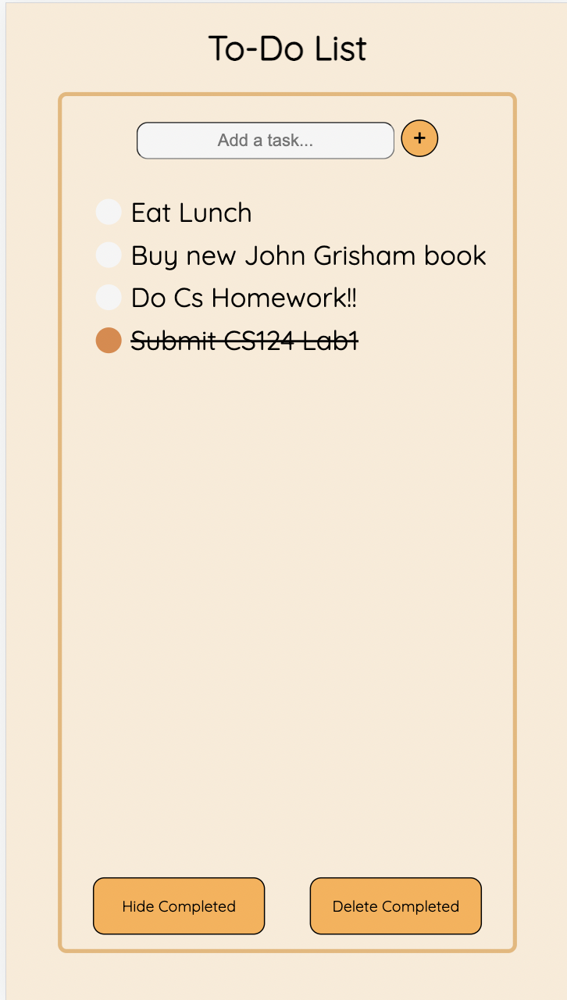

We also have images from different stages of our application to show the flow when completing the different tasks that it is intended to do. 

### Task 1: Adding a task to an empty list

Screen at the Beginning of the task:
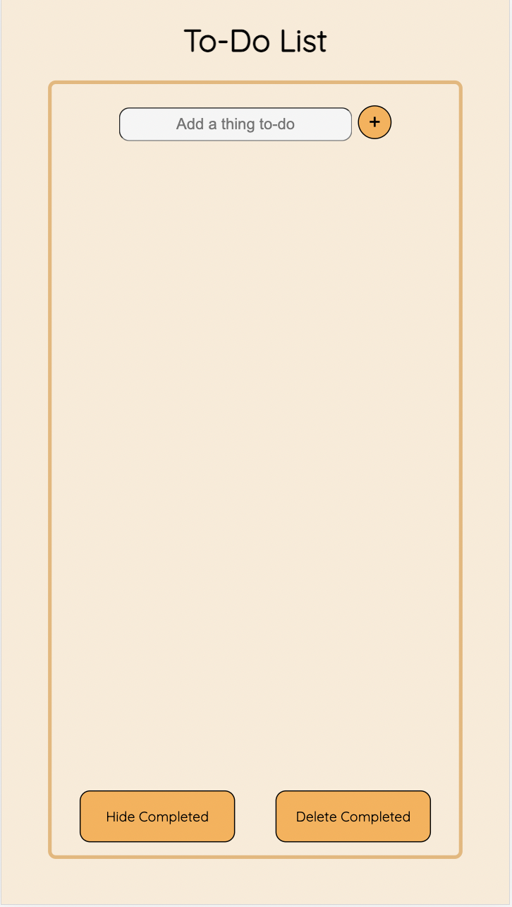

Screen during the process of adding an item to the list:
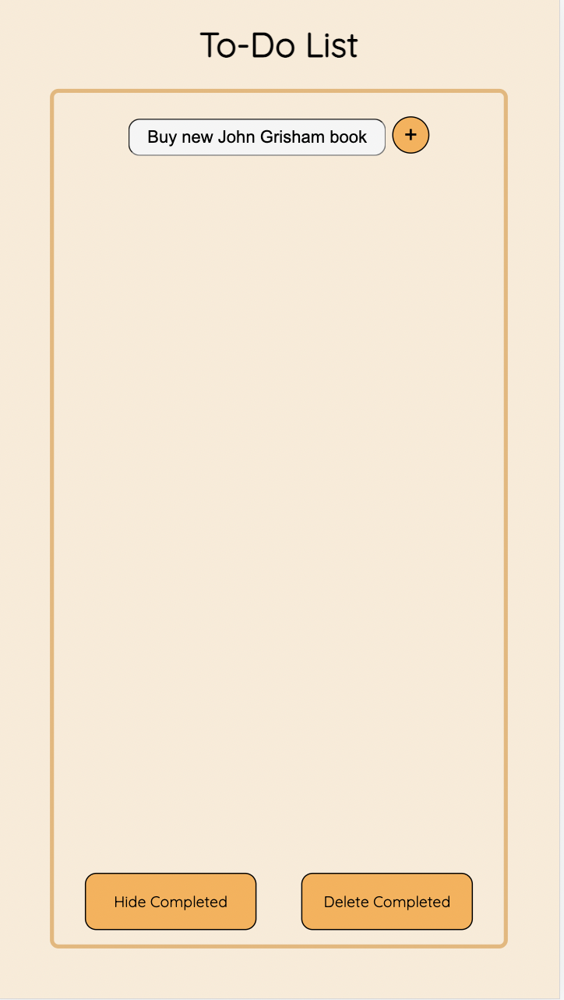

Screen after adding said item to the list:

### Task 2: Adding an element to a non-empty List

Screen at the Beginning of the task:
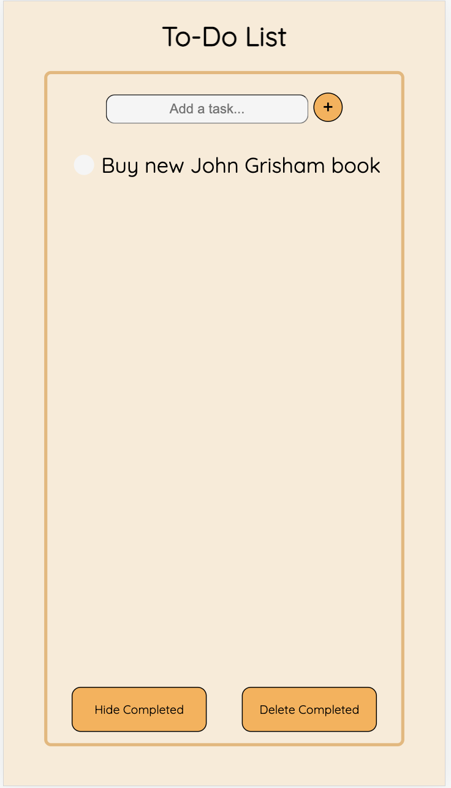

Screen during the process of adding the item to the list:
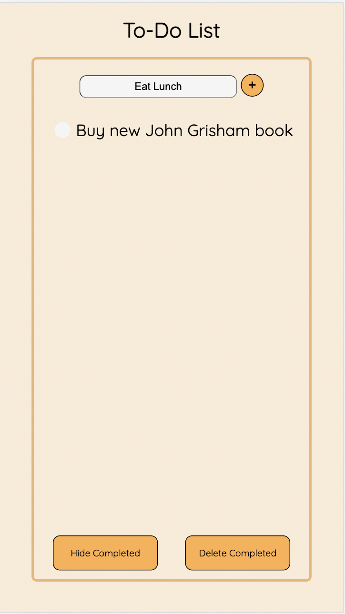

Screen after adding said item to the list:
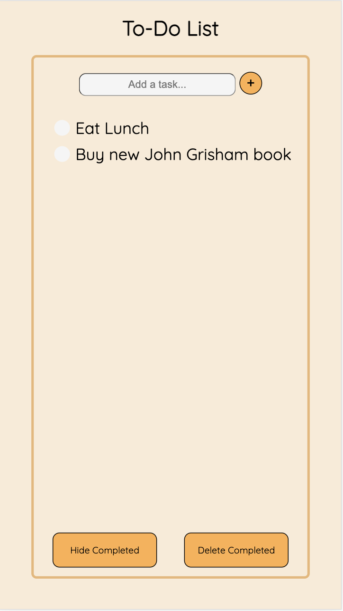

Here we can see how our app deals with new items when there are already existing things to do. 
It simply adds it to the top, and moves the rest down, like a stack. 

### Task 3: Mark an Item completed

Screen at the Beginning of the task:
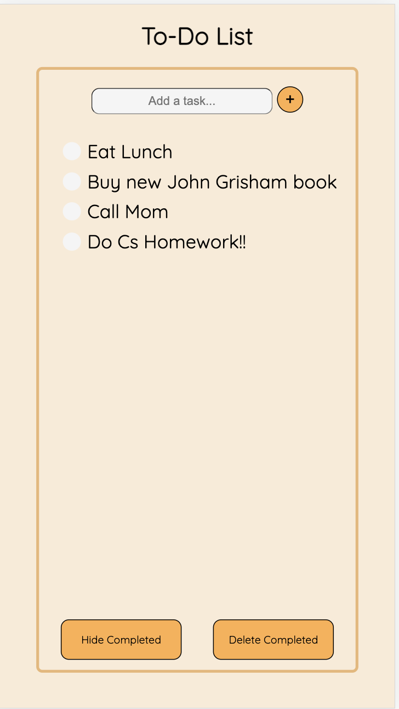

Screen after marking item as completed:
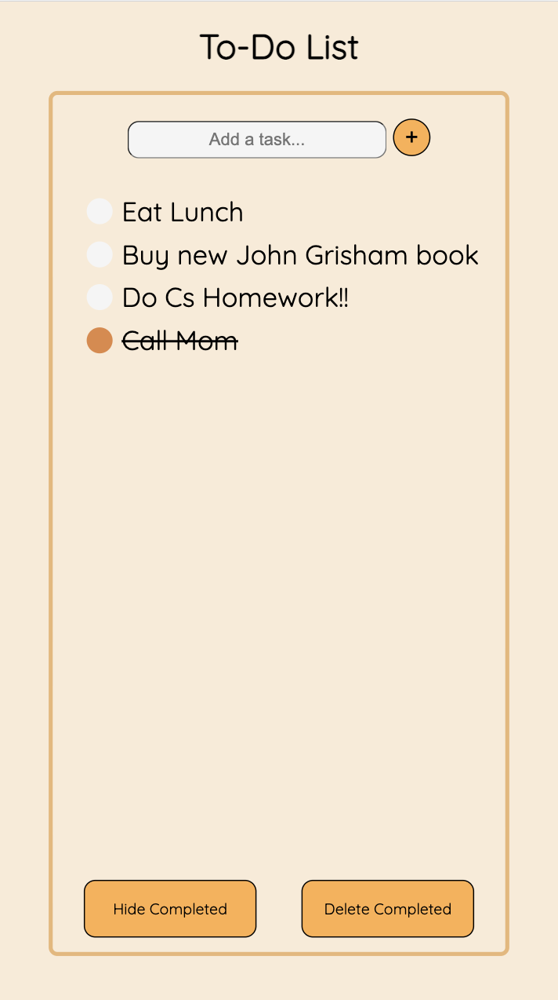

Our app moves the completed items to the bottom of the list, as talked about earlier, therefore grouping all
completed and uncompleted items together. 

### Task 4: Rename an item in the list:

Screen at the Beginning of the task:
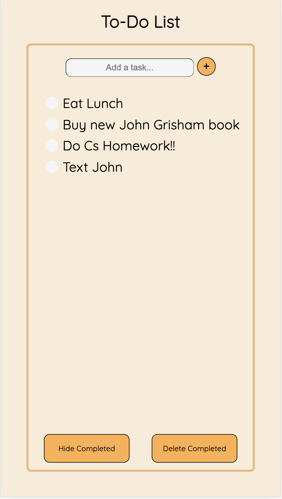

Screen during the process of renaming the item
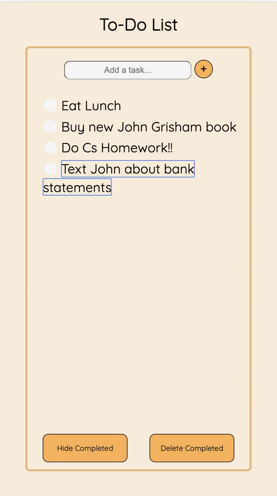

Screen after renaming the item

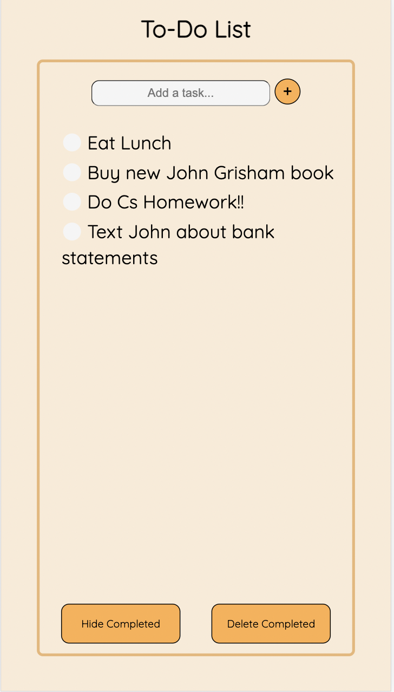

To rename the item, our text is editable, and thus when a user clicks on the text, they are able 
to rename that to whatever they please. whether this be completely removing text, or adding some more. 

### Task 5: To show only uncompleted items

To accommodate this task, we have a button called "Hide Completed", which is pretty self explanatory. 
On clicking this button, the application will hide all completed tasks from the user, and the button's text changes
to show all. Clicking this button show all will revert to the stage where all tasks, both completed and uncompleted are visible

Screen at the Beginning of the task:
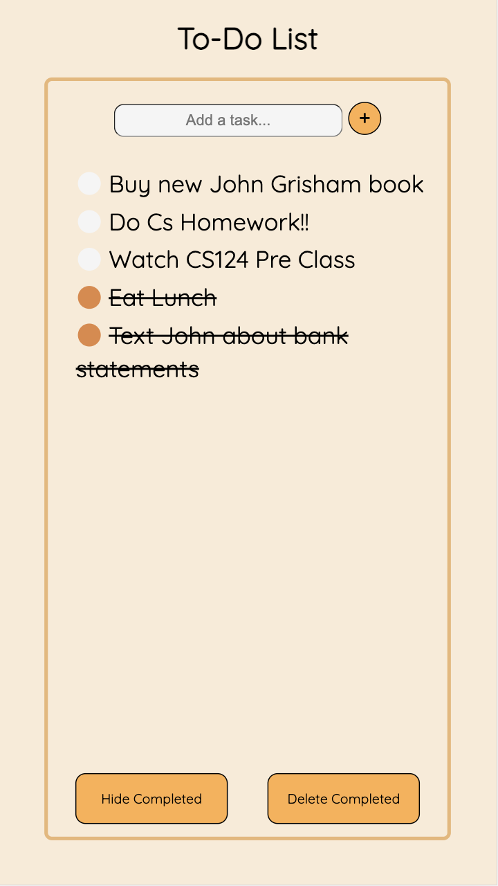

Screen after clicking hide completed button:
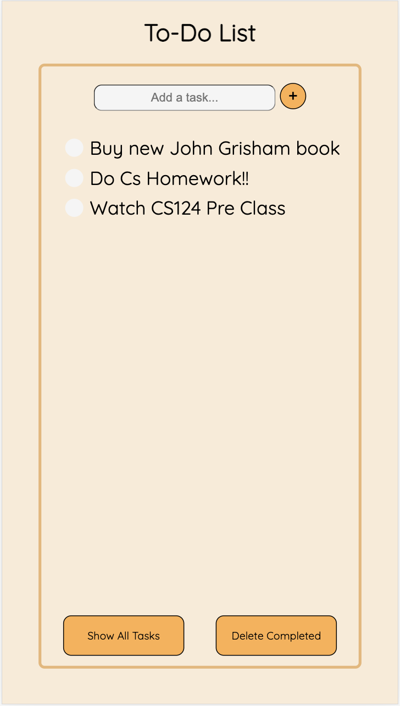

### Task 6: Delete all completed tasks:

For this function, our app has a "delete completed" button, which when clicked will 
delete all items that are marked as checked/completed in the list, leaving only the uncompleted 
tasks on the screen. Unlike hide completed tasks, this is not reversible, and actually removes them, rather
than just not showing the completed tasks. 

Screen at the Beginning of the task:
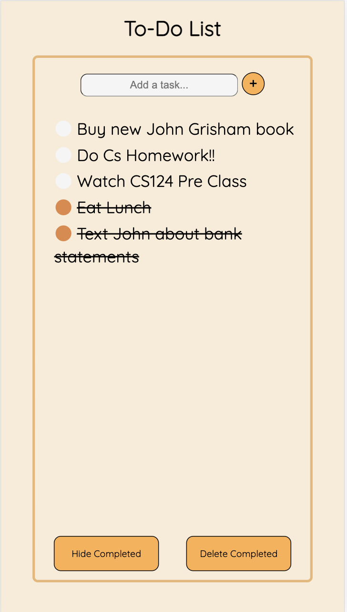

Screen after deleting all completed tasks:
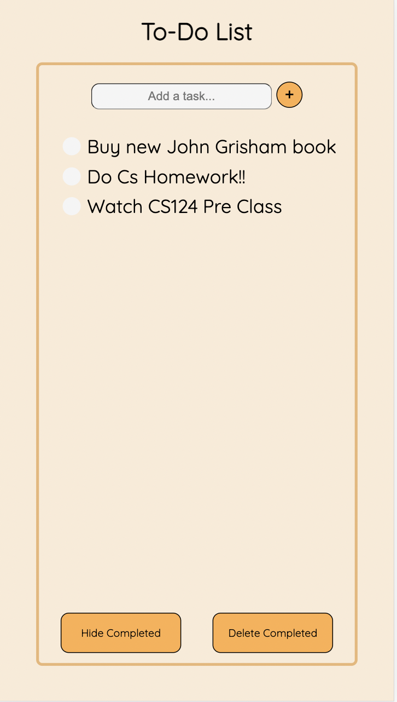

## Challenges Faced

Our initial mistake was in understanding the purpose of this lab. We thought that we had to make a fully functioning JavaScript based
Web App that would allow all the To-Do List functionalities. Hence, we spent a few hours, initially working in Raw JS trying to make this a
proper To-Do List. After we realized that the task was to simply make static webpages, our process went a lot more smoothly and we did not face any really 
problematic challenges. 

I think the primary thing that we struggled with was just not being able to align elements correctly with GridBoxes.
Also, it took us a while to select a font that we were happy with because some of the initial fonts we chose had weird ways of
displaying hyphens. Hence, we finally arrived at the QuickSand font which is a Google Font (and we think it looks pretty good!).

## Part of the Design you are most proud of: 

We are quite proud of the color scheme that we ended up using. We both think that we are not super artistic and hence are quite proud of how pleasing
our To-Do List looks. The general minimal design that we have come up with also looks quite nice in our opinion with the rounded corners of all the elements on the page.

