# CS124: Interaction Design Lab 1 , Lab 2, , Lab 3 and Lab 4.

(Saatvik Sejpal, Anirudh Satish
)

This Document is the Design Document for a To-Do List. It contains all our initial designs, steps along our iterative process, 
and screenshots of the flows of all the tasks that our application is meant to do. We also talk about user testing, and other highlights of the application. 

## Design Decisions

### Early Design Process and Alternative Designs
Our design process began with some discussions on what a to-do list is meant to do, and a few simple
sketches of prospective desings that are included below.

We thought about the "plus" button being floating, moving down as we added items.
Although this probably looks cool, this is not ideal as the user needs to search for the "plus"
button each time, and therefore we decided against the same.
We also thought about having a separate section for completed items at the bottom of the screen; however, we decided
to just do away with having a separate section and just float the completed tasks to the bottom of the page when we mark them
completed.

The intent of the "plus" button in our initial designs was to bring up a text box
for input. But after some deliberation, we came to the conclusion that this was unnecessarily
complicated and tedious. Thus we reverted to a fixed text input box at the top of our list, 
with a plus button to add the item to the list.

## Lab 1 Design:

When an item is added to our list, and the enter/plus button is hit, it gets added to the list much like it would to a stack, 
that is it gets added to the top, and the other elements would move down to make space for the newly 
added item. 
When an item is clicked, it gets marked as checked, both via the checkbox and the text itself being striked-through. It also floats to the bottom of the page with the other
completed items.
We decided to go with this design as it makes it abundantly clear to the user when an item is marked as checked/completed or not. 

Additionally, if we ever were to have too many elements in the list, a scroll wheel would be visible on the right to allow the user to scroll through
all the items in the list, and this also avoids against any instances of the items of the list overlapping with the delete and hide buttons
at the bottom of the application. 

The "Hide Completed" Button's purpose is to hide all completed/checked tasks, and the "Delete Completed" button is meant 
to delete all completed tasks from the list.

## Lab 2 Design (changes in Lab2 React implementation):

### List items, completed and uncompleted items
In Lab 2, We implement our app using React, to create a working To-Do list. We made some changes to the initial design in this lab
First, when a new item is added, it does not stay at the top of the List like a stack, but we move it to the bottom of the list (of uncompleted tasks)

Next, when an item is checked, we do move it down the list to a section that has all completed items. However, as opposed to moving a newly checked item to the 
very bottom of the list every time, we move it to the completed section, while still maintaining the order in which they were inserted in the 
to-do list.

### Buttons:
Based on feedback from Lab1, we made some changes to our buttons in this iteration of the project. 
Firstly, if a button is in a situation that it cannot/should not be used, we grey it out, and then disable the actions of the same

Therefore, for the add (+) button, until and unless an input is typed in the text box, it remains greyed out, and as soon as we enter/add the typed item
to our to-do list, it gets greyed out again.

Along the same lines, when no items are marked as completed, or when the to-do list is empty, the "hide completed" and "delete completed" buttons are
greyed out to indicate that they cannot be used (have no function). In addition to this, the buttons are disabled so that accidentally clicking on them does not trigger any
unwanted actions

When the "hide completed" button is clicked to hide items, the delete button becomes grey and disabled so that users do not accidentally delete
items that they cannot see. Therefore, you can only delete completed items from the list if you are in the visibility mode where you can 
see all the items. 

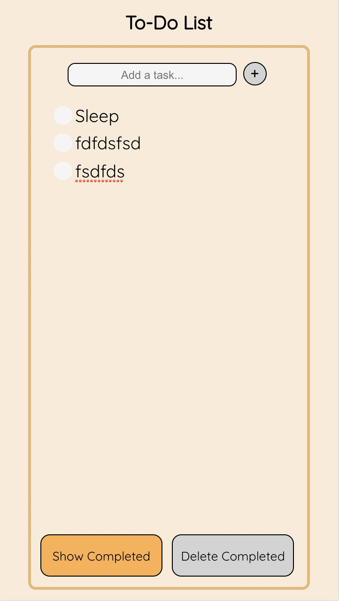

Finally, we considered comments from Lab 1 about our buttons for the items resembling radio buttons. However, considering the context that they are in (todo list app)
plus the results from the user testing we did, we decided to keep the same design for the buttons (as they also match our rounded theme without sacrificing usability)

### Alert when Delete button is clicked

We added an alert box for when the "delete completed" button is clicked, warning the user that they are going to make an irreversible change, 
and asking them to confirm if they want to carry out the action, or hit "No" to revert to the initial state of the list (before the delete button was clicked)
For this alert, we used an Alert package called Sweet alert. The documentation for this alert is below. 

We implemented our own CSS to style this alert as to meet the design and theme of our To Do List. 

A small note: The sizes of the "No" and "Yes" are actually the same. But the "No" button looks slightly bigger 
because by default, that is the one that is selected, and if enter is hit, the "No" button is pressed. We thought about
changing this, but then decided that this makes senese, as users cannot accidentally delete items by hitting enter two times. 

Sweet Alert: https://sweetalert.js.org/

### Changes to Label-Checkbox implementation

To implement editing of items in the Todo List, we removed the functionality of clicking on the label as well to mark the items. Instead, now to mark an item 
as completed, a click on the checkbox is required. Clicking on the label enables editing of the text, and allows the user to change the name/title of any task already 
in the todo List. 

Additionally, to deal with long tasks (singel task), we implemented a horizontal scrolling mechanism, rather than wrapping. An example of the same is shown below. 
This screenshot is a frame while scrolling to the right to see the full item.

### Vertical Scrolling

After thinking about edge cases/possible situations where our initial design might break, we thought about implementing 
a vertical scrolling mechanism to help deal with lists that have a lot of tasks. A picture of the same is attached below for illustration. 
The scroll bar can be seen on the right side of the app. 

## Lab 3 Design:

To incorporate the added functionality of priority for tasks, we needed to make some substantial changes to our 
design. These were:
1. Adding a dropdown at the top of the application to allow the user to choose what metric they want to sort by.
2. Adding a dropdown by the input field, to allow the user to add the priority of the task they add to the list. However, users who do not care about priority can continue to use the app with no hiccups, as the default priority of 1
   is applied to all the entered items.
3. A dropdown for each task in the list, indicating the current priority, allowing for editing/changing functionality of priorities.
4. To add the dropdown for each list item, we incorporate a one dimensional gridbox for each list item, which is inserted
   into the two dimensional gridbox that holds all the contents of the list, and the buttons and input fields.

Throughout this design, we maintain our design philosophy of greying out all buttons that cannot be used. Therefore, when
there are no items to be filtered, the filter button remains greyed out, and similarly when there is nothing to add, 
the priority button by the input field remains greyed out. 

### 1. Dropdown at the top: 
The dropdown at the top provides three features to the user. We allow the user to filter by Name, Priority, or Date Created . 
The pictures for the flow of performing a sorting task are below. 

#### Filter Button at the beginning of the task:
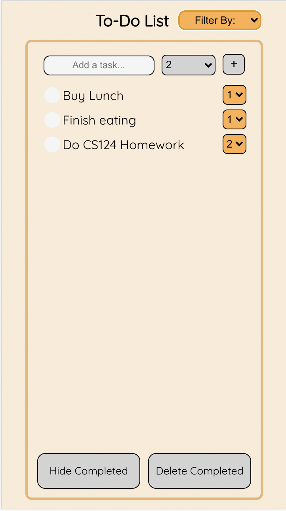

#### Filter Button while selecting a metric to filter by:
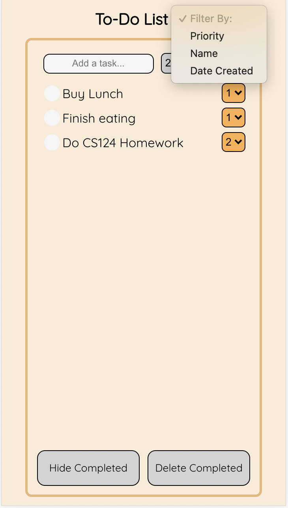

#### Filter Button after selecting a metric to filter by:
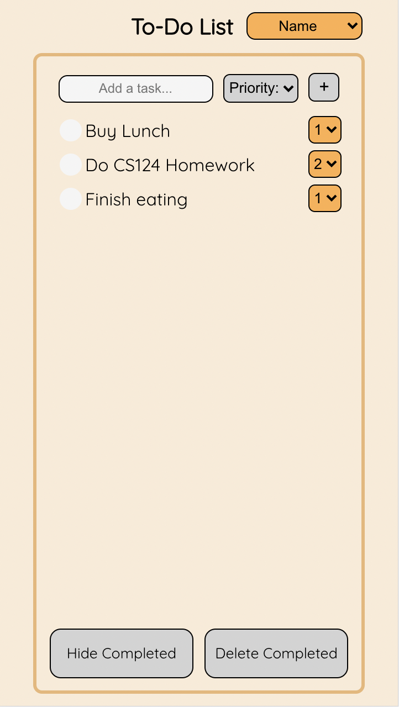

### 2. Dropdown by Input Field:

#### When there is nothing in the input field, the dropdown button remains greyed out
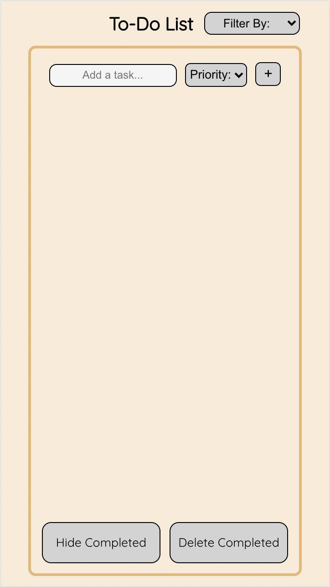

#### While typing, the button becomes orange to indicate that it can be used.
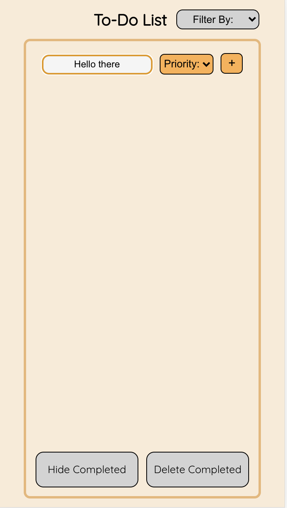

#### Clicking on the button gives the following dropdown.
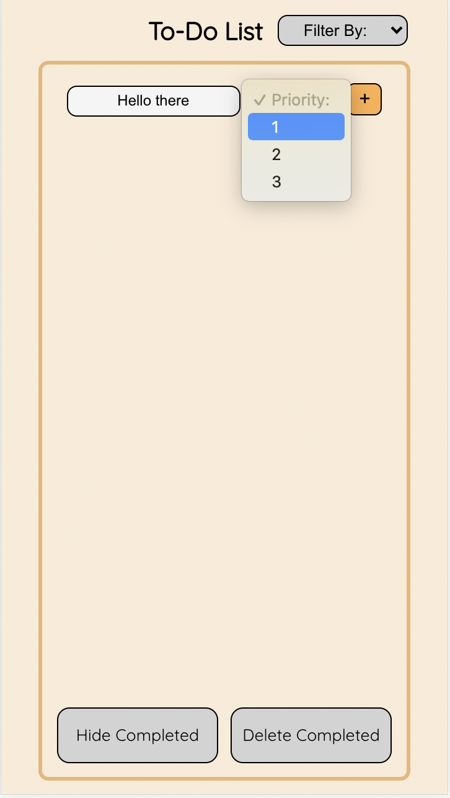

#### After selecting the priority, and enter/item is added. 
Then, the item is added, and the next priority remains the same.
This allows users to enter multiple items in quick succession with the same priority.

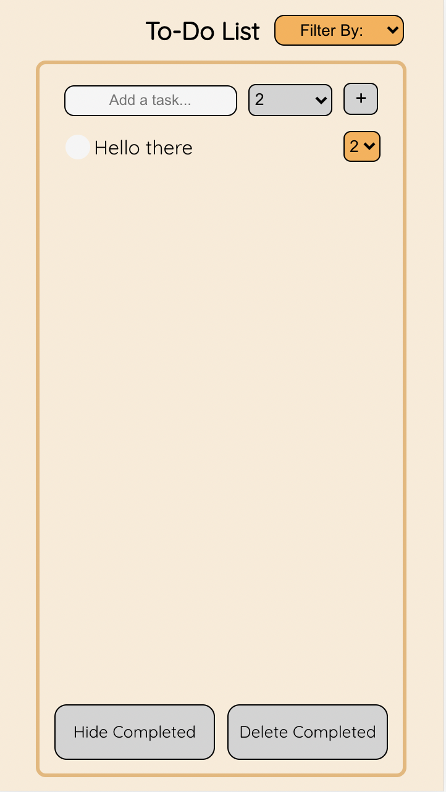

### 3. Dropdown button for each task item in the list:

#### Before editing the priority of the task, screen looks like this.
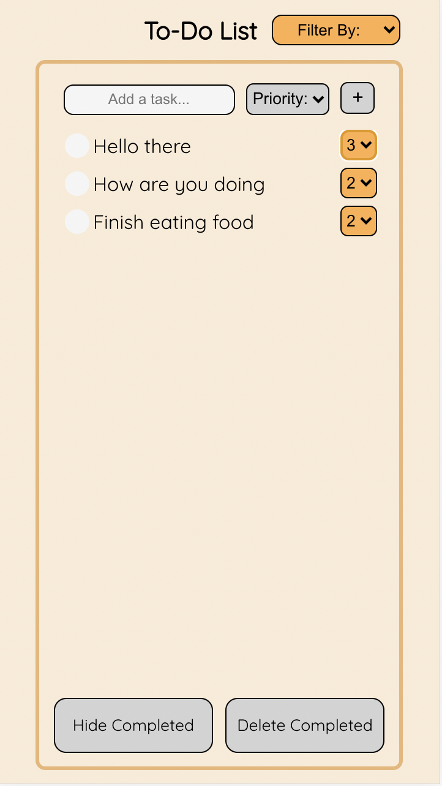

#### Screen while editing the priority:
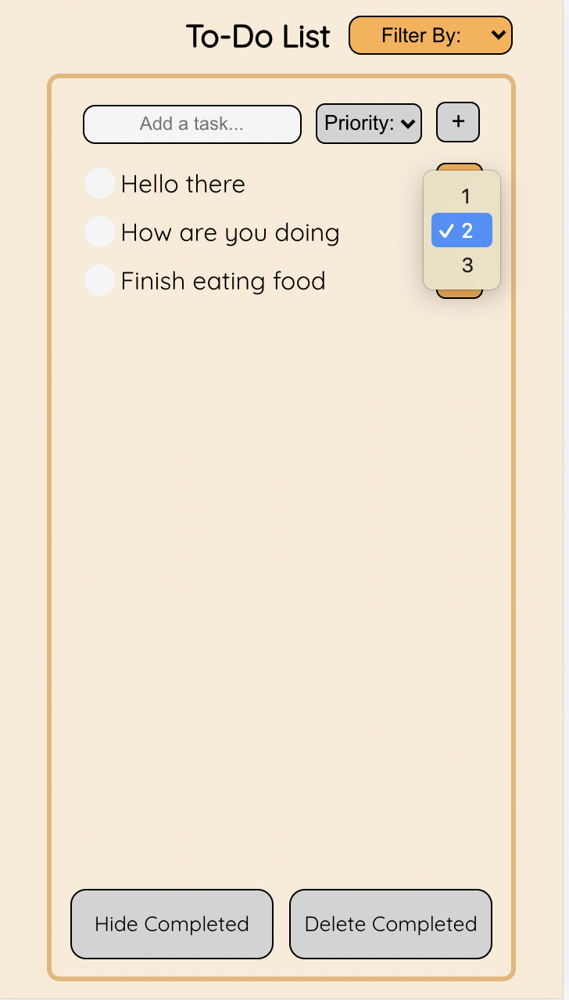

#### Screen After priority is edited:
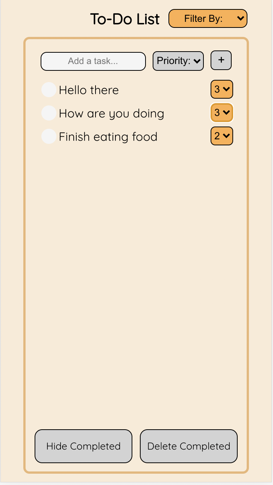

## Lab 4 Design:
For this Lab, we added more functionality to our application. These were accessibility (both tabbing and voice over), multiple list functionality and support for multiple
screen sizes. 

### Accessibility:
TODO
Tabbing follows the order of HTML as it is generated. During all our labs, we were conscious about this, and ensured
that we generated our HTML in the order we want it displayed. Therefore, tabbing through the application (including shift+tab for going in the backward direction) works
really well. Additionally, using the spacebar/enter key to select, move to different pages of the application depending on what the feature is 
is needed. Exactly how these mechanics work is addressed in our YouTube video linked below!

### Multiple Lists:

Multiple lists is a must-have feature in any good To-Do list. Now that we have a much better understanding of React, and components, 
we were able to implement the same with little to no hiccups. The design for this follows our philosophy that we used for items in our single list To-Do List. 
When the application is opened, a screen with all the lists is shown (if any exists, else empty), and adding a new TaskList is the same as adding a new item. The TaskList name is entered in the text input field, 
and then it is added to the "List of Lists" or "List of TaskLists". 

Each TaskList name can be edited by clicking on it, much like the items in the To-Do List. Then, for each TaskList, there is a "Go" button, which when clicked 
opens the "TO-Do List" for that TaskList. Once inside a particular list, we also have a "back" button to allow the user to come back to the main screen with all the different TaskLists, to do other actions. 
There is also a delete button, which allows users to delete entire TaskLists individually. However, since deleting a whole TaskList
is a big task (in that you do not want any mistakes), we have an alert pop up to indicate to the user that this is an irreversible action, asking for confirmation to proceed. 
We also have a delete-all-lists button that is pretty self explanatory. It deletes all the TaskList, and therefore all the individual tasks in all the TaskLists. Naturally, as this is also a potentially dangerous action, 
we have an alert box asking for confirmation from the user that they intend to do the indicated action. 

There are some pictures below to show this new features. 

Homepage:

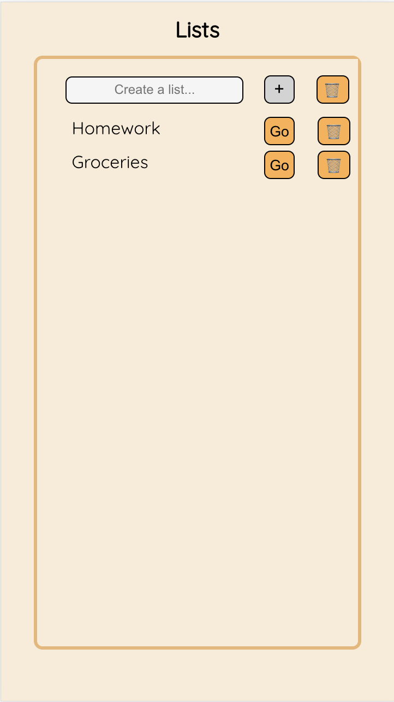

Inside a particular TaskList:

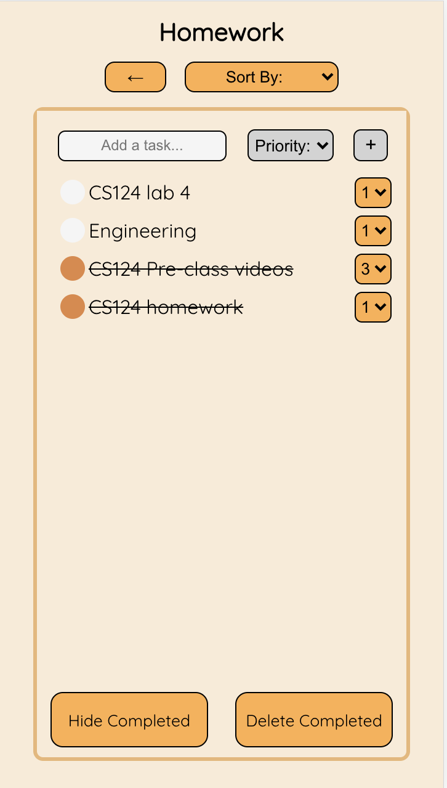

### Multiple Screen Sizes:

Responsive design is a very important component of an application, that allows it to be used on different sized devices, from different manufacturers. 
While our design works for mobiles, desktops and iPads in both landscape and Portrait mode, the way our CSS works allows the application to be viewed in all sizes of screen in between and larger than these three mentioned
sizes, which we think is very cool and important. That is, not only does it work on Moto G4, but also on other mobile devices, and other tablets, and desktop sizes and aspect ratios. 

When used on larger screens, our application is not just a zoomed in version of the mobile screen, but the extra screen real estate is used for more items/tasks/TaskLists
to be visible at once without scrolling. We do have slightly larger fonts for bigger displays just to make it easier on the user to parse the information, and use the application to its best potential. 

A few pictures indicating the application in different screen sizes are below!

## User Testing:

### Lab 1 (static app)
We showed our project to one of our roommates, who we will refer to as Person A in this section. As we do not have a working 
page/application due to the lack of javascript, we just spoke about the design, their first thoughts on how useable it was, etc. 

Person A believed that our application was quite clear on how to add elements to the to-do list, which was via the text input at the top
followed by an enter keystroke, or hitting the plus button. Additionally, they liked our idea of how checked items/completed items 
would float down the list and pile up at the bottom of the list, creating a clear demarcation between uncompleted and completed tasks. 

They did mention something that we feel could be useful if we are ever to actually implement javascript for this application. To edit 
items that are already in the list, they felt that a long press on mobile was the most intuitive and logical way to edit tasks. 
Therefore, we would like to add this functionality in our future implementation. 

### Lab 2

#### Person B:
(This user testing was done before the complete version of the app was done. i.e, the alert box was not implemented, along with some other teething issues
such as wrapping)
Person B also had positive feedback about our application. They were impressed by how hitting enter while adding an item added it to our list. 
They also suggested that when the hide completed button was clicked, and the completed items were hidden, the delete button should be deactivated, so that users do not accidentally delete something they did not intend to.
(This feedback was implemented in our final version). Person B also spoke about how it would be nice if when they checked an item to mark as completed, if it first visually showed itself being checked, and then moving 
to its respective place in the lower portion of the list rather than immediately jumping there. They also said, that when adding an item to a list, the focus in the List changed to that item. This would be particularly useful when there are 
a lot of items in the list, and the user gets lost when adding new stuff to an already large list. This is something that we have tried to implement, but are stumbling on in the final stages. 

Person B was also impressed with the vertical scrolling to accomadate for very large lists with a lot of items. 

#### Person C:
Person C thought that our app was overall quite intuitive and easy to use. They were particularly happy that clicking the "Enter" key
while adding a task actually created it and that they did not have to click on the "+" button. Furthermore, they were also impressed by the 
Alert Box that shows up when a user attempts to delete a task. One thing that Person C thought was not immediately obvious, was that the tasks were editable
on click. At the moment, we could not think of a way to make it more obvious while maintaining our minimal design, but we will give it more thought in future labs.
Person C also thought that when a task is too long, it was perhaps not convenient that the task extends on the same line and allows the user to scroll horizontally.
While we do note Person C's thoughts, we were having trouble wrapping the text of a task that was too long correctly.

### Lab 3

#### Person D. 
This user testing was done before the complete version of our application for this lab was completed. 
This person's feedback really helped and resulted in some changes in our delpoyed model. 
This user, while adding items to our list, did not know what the 1, 2, 3 referred to priorities. At this stage, 
the dropdown in our input field for priority did not have any text, and was simply 1, 2, 3 as well. So the user was confused, and assumed that
these numbers implied how long it should take them to complete the task. Therefore, we took this feedback, and edited the 
priority button in the input field to have the text priority while loading as its default value, so that users know what it is. 

Person D also commented on how the dropdown for the filter button said "Created", and suggested that "Created Date" would be more
informative, and we took this advice and made the required change to our app. 
This user also really liked our alert that pops up when deleted items are deleted. 

## Screenshots and Images from our implementation:

Attached below is a screenshot of our application at a random stage, with some items in the list, and some items marked as checked.

We also have images from different stages of our application to show the flow when completing the different tasks that it is intended to do. 

### Task 1: Adding a task to an empty list

To add an item, simply type in the input text box at the top of the app, and then hit "Enter/Return" on your keyboard, or the + button
to add the item to the list.

Screen at the Beginning of the task: 

Screen during the process of adding an item to the list:

Screen after adding said item to the list:

### Task 2: Adding an element to a non-empty List

To add an item, simply type in the input text box at the top of the app, and then hit "Enter/Return" on your keyboard, or the + button
to add the item to the list.

Screen at the Beginning of the task:

Screen during the process of adding the item to the list:

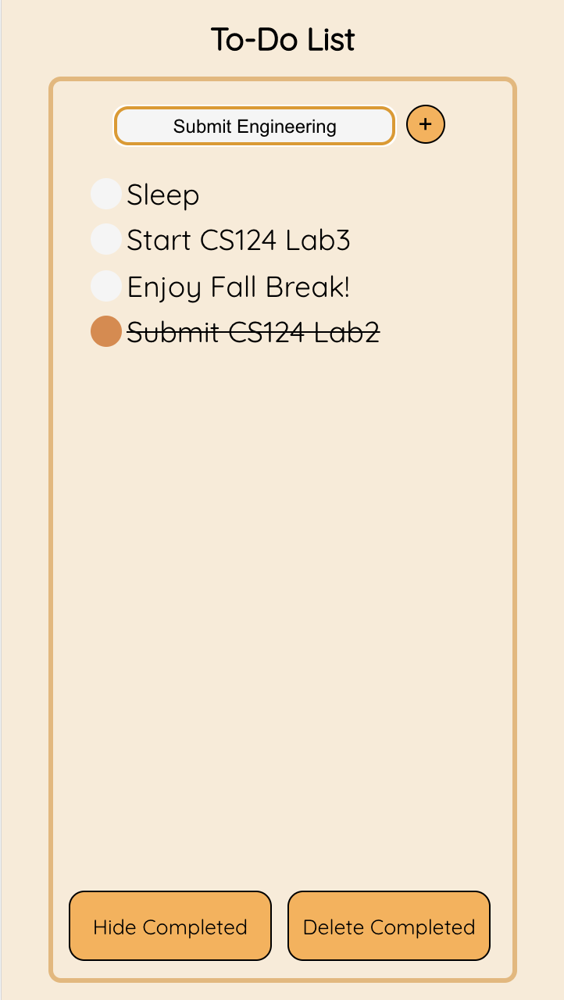

Screen after adding said item to the list:

Here we can see how our app deals with new items when there are already existing things to do. 
It simply adds it to the bottom of the unchecked portion of the list (if there are any checked items). Therefore, a newly added item floats down the list
and gets added just above completed items (if any)

### Task 3: Mark an Item completed

To mark an item as completed, simply click on the check button on the left, and this marks the item as completed. 

Screen at the Beginning of the task:

Screen after marking item as completed:

Our app moves the completed items to the bottom of the list, as talked about earlier, therefore grouping all
completed and uncompleted items together. 

### Task 4: Rename an item in the list:

To rename a task, a click on the text is all that is required. Once done editing, simply click away (in a different position) or 
hit enter

Screen at the Beginning of the task:

Screen during the process of renaming the item:

Screen after renaming the item:

To rename the item, our text is editable, and thus when a user clicks on the text, they are able 
to rename that to whatever they please. whether this be completely removing text, or adding some more. 

### Task 5: To show only uncompleted items

To accommodate this task, we have a button called "Hide Completed", which is pretty self explanatory. 
On clicking this button, the application will hide all completed tasks from the user, and the button's text changes
to show all. Clicking this button show all will revert to the stage where all tasks, both completed and uncompleted are visible

Screen at the Beginning of the task:

Screen after clicking hide completed button:

### Task 6: Delete all completed tasks:

For this function, our app has a "delete completed" button, which when clicked will bring up an alert tab, 
asking the user to confirm their action, or revert back. If they chose to delete all items delete all items that are marked as checked/completed in the list, leaving only the uncompleted 
tasks on the screen. Unlike hide completed tasks, this is not reversible, and actually removes them, rather
than just not showing the completed tasks. 

Screen at the Beginning of the task:

Screen during the alert pop up: 

Screen after deleting all completed tasks (if yes):

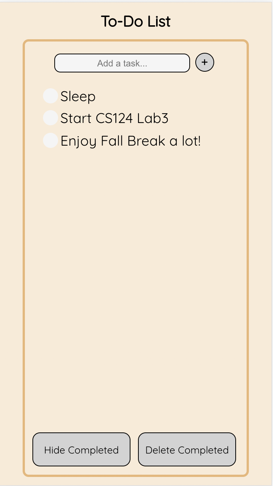

Screen if No/Cancel is hit: 

## Challenges Faced

### Lab 1
Our initial mistake was in understanding the purpose of this lab. We thought that we had to make a fully functioning JavaScript based
Web App that would allow all the To-Do List functionalities. Hence, we spent a few hours, initially working in Raw JS trying to make this a
proper To-Do List. After we realized that the task was to simply make static webpages, our process went a lot more smoothly and we did not face any really 
problematic challenges. 

I think the primary thing that we struggled with was just not being able to align elements correctly with GridBoxes.
Also, it took us a while to select a font that we were happy with because some of the initial fonts we chose had weird ways of
displaying hyphens. Hence, we finally arrived at the QuickSand font which is a Google Font (and we think it looks pretty good!).

### Lab 2
One of the first challenges we faced was when we were trying to make completed items float below our uncompleted items was that the text of our item would move down; however,
the item that takes its place would be marked as completed. This bug took us a really long time to figure out until we realized that we had to use keys so that React would know
which list item actually needs to be moved where.

Another challenge we faced was wrapping the text in the same alignment as the first line of the task. The text would wrap below the checkbox and we were unable to find a fix for this.
Hence, we changed our implementation so that if a task was too long it would continue on the same line and provide a horizontal scroll bar.

### Lab 3
We struggled a lot with understanding the filtering and how firestore implements this. The thing that took us a while to figure out 
was how to re-render the React app when the filter query is run, on the new filtered data. We managed to overcome the issue by
using two different queries, one that uses an OrderBy clause when filter is active, and one that is just our default query when we just want to pull the data as is from firestore. 

Another big issue we had this lab was getting the app working simultaneously on two different tabs or devices. We were very puzzled 
as this functionality seemed to work in most instances, but not completely. For instance, adding an item/editing an item worked well, and
we could see the update on the other tabs when the change was made on one. However, when an item was marked as checked, or the priority of the same
was changed, the changes were not showing on the other devices. It took us a while to debug this, but we figured it out, and the issue was with
us using a React state, when the props could be used directly. 

## Part of the Design you are most proud of: 

We are quite proud of the color scheme that we ended up using. We both think that we are not super artistic and hence are quite proud of how pleasing
our To-Do List looks. The general minimalist design that we have come up with also looks quite nice in our opinion with the rounded corners of all the elements on the page.

We are really happy with the way our completed items move to the bottom portion of the list. We are proud of how we implemented this and also that we understand how it works. 

We are also quite pleased with the SWAL alert box that we have when the delete button is clicked. We were able to style this in an attractive way that matched our 
app. 

### Lab 3:
We are very proud of how our app turned out this week. Firstly, the new buttons we added do not clog the screen. 
They are quite nice in their location with regards to the other elements. Also, the philosophy we have of greying out the buttons 
when they are not in a position to be used is incorporated with all of these buttons, and we are quite pleased with that. 

When a metric for sorting is selected, and changes are made to the tasks in the list, its position changes dynamically. That is, 
it slots into its required position according to the filter as soon as the change is made. We think this is pretty cool, and are really happy with this functionality. 

We are also proud of our alignment of elements in this application. We used the advice from the guest lecture from Wednesday's class
and applied the same to our app. We tried our best to align elements with something else, and we think this turned out really well. 

